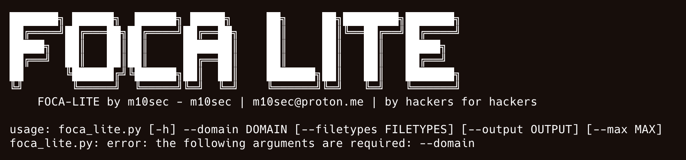

# 🕵️‍♂️ FOCA-LITE – Metadata & Passive Recon Toolkit

**FOCA-LITE** es una herramienta de análisis pasivo de metadatos inspirada en la legendaria FOCA de Chema Alonso, pero reimaginada en Python por [m10sec](mailto:m10sec@proton.me). Escanea documentos descargados de fuentes públicas, analiza sus metadatos, y genera reportes HTML/CSV detallados. Ideal para OSINT, pentesting y auditorías digitales.



---

## 🚀 Características

- 🧠 Crawling de documentos públicos (`site:` + `filetype:` + `index of`)
- 🔍 Análisis profundo de metadatos (PDF, DOCX, XLSX, ZIP, JPG/PNG, TXT, CSV)
- 🧽 Limpieza segura de metadatos sensibles
- 📊 Reportes automáticos en **HTML** y **CSV**
- 🎨 Banner personalizado y CLI interactiva (con `prompt_toolkit`)
- 🛡️ Ideal para red teams, OSINT y bug bounty hunters

---

## 🧰 Instalación

### 🔧 Requisitos

- Python 3.8+
- `exiftool` instalado en el sistema:
  - macOS: `brew install exiftool`
  - Ubuntu/Debian: `sudo apt install libimage-exiftool-perl`

### 📦 Instalar dependencias

```bash
git clone https://github.com/moften/Metadata-Web-Extractor-Foca-Lite.git
cd Metadata-Web-Extractor-Foca-Lite
python3 -m venv venv
source venv/bin/activate
pip install -r requirements.txt
```

---

## ⚙️ Uso

### 📁 1. Recolección de archivos con dorks

```bash
python foca_lite.py --domain gobierno.mx --filetype pdf
```

Descargará documentos públicos y los almacenará en la carpeta `output/`.

### 🔬 2. Escaneo de metadatos

```bash
python foca_lite.py --analyze output/
```

Muestra metadatos y permite generar reportes.

### 🧽 3. Limpieza de metadatos

```bash
python foca_lite.py --clean output/
```

Crea versiones limpias de todos los documentos.

---

## 📊 Reportes generados

- `report.csv` – formato para análisis con Excel, Google Sheets, pandas.
- `report.html` – visual amigable con tablas, exportable o embebible.

---

## 📷 Capturas

| Análisis CLI | Reporte HTML |
|--------------|--------------|
|  |  |

---

## 🤝 Contribuciones

¿Encontraste un bug, o quieres colaborar con nuevas features como análisis de OLE, RTF, archivos antiguos de Word o integración con Shodan?

**Pull requests, forks y mejoras bienvenidas.**

---

## 🙌 Apóyame

Si esta herramienta te ha sido útil o quieres apoyar futuros desarrollos, puedes invitarme un café ☕ o hacer una donación. ¡Cualquier apoyo cuenta!

[](https://www.paypal.com/paypalme/moften)

---

## 👾 Autor

** m10sec **  
Pentester, Red Team Specialist, Dev de herramientas ofensivas.

- 💌 Correo: [m10sec@proton.me](mailto:m10sec@proton.me)
- 🌐 Blog: [https://m10.com.mx](https://m10.com.mx)
- 🐦 Twitter: [@hack4lifemx](https://twitter.com/hack4lifemx)
- 💼 LinkedIn: [Francisco Santibañez](https://www.linkedin.com/in/franciscosantibanez)
- 🐙 GitHub: [github.com/m10sec](https://github.com/moften)

---

> “Los metadatos no mienten. Solo los ignora quien no sabe lo que busca.” – m10sec